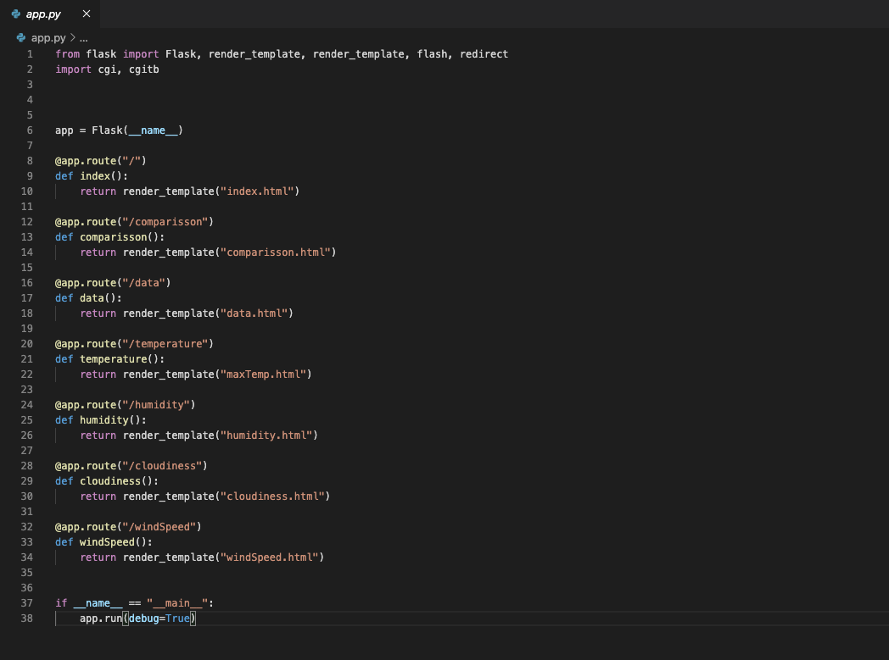
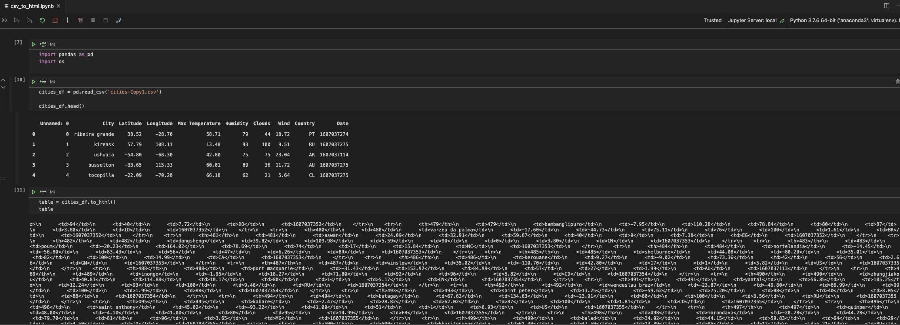
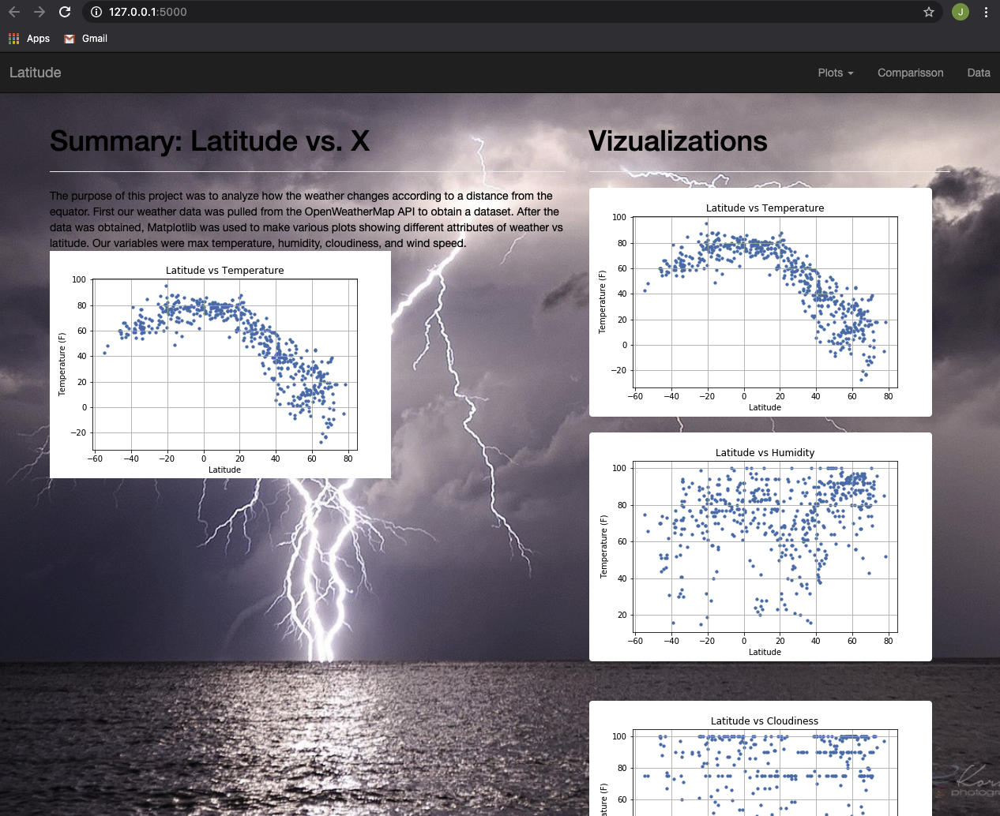
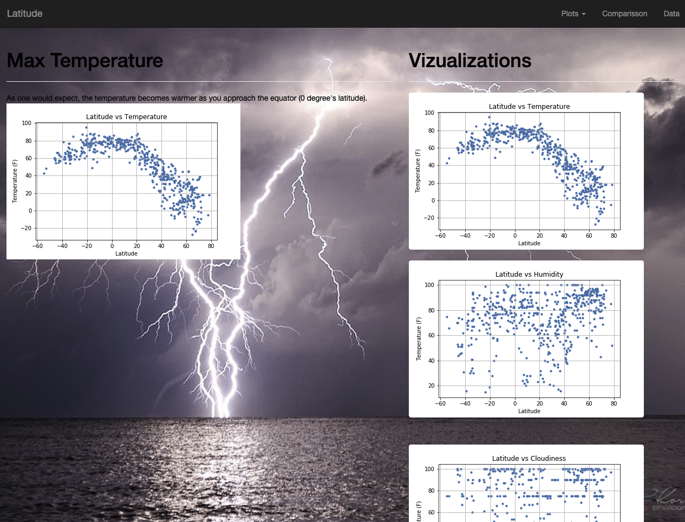
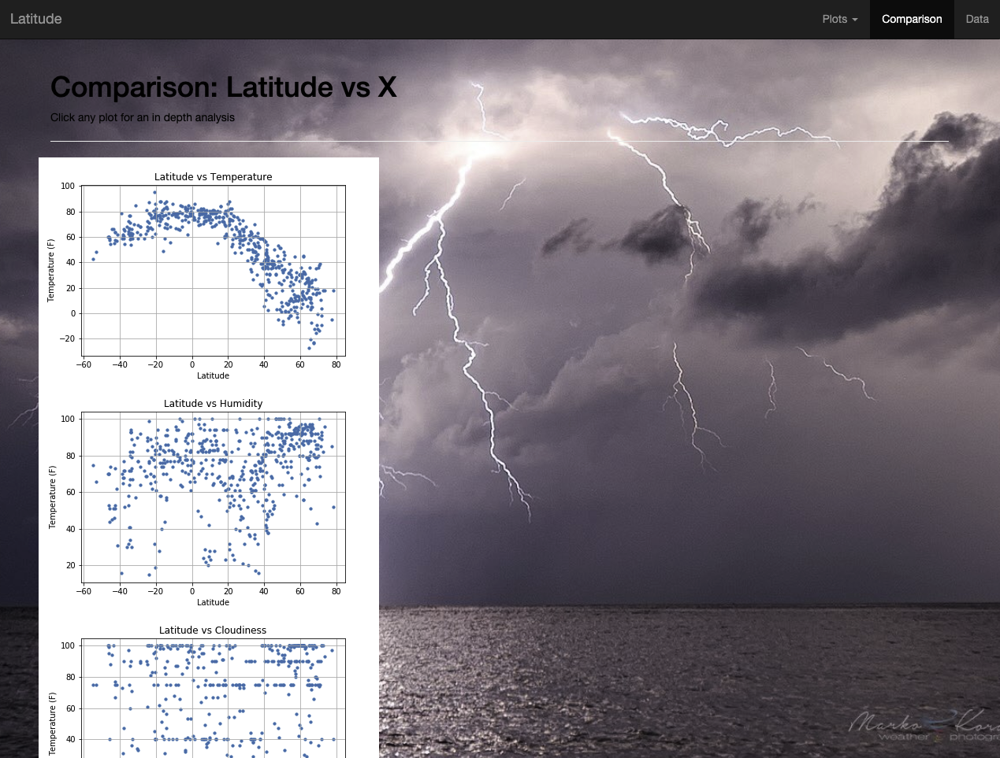
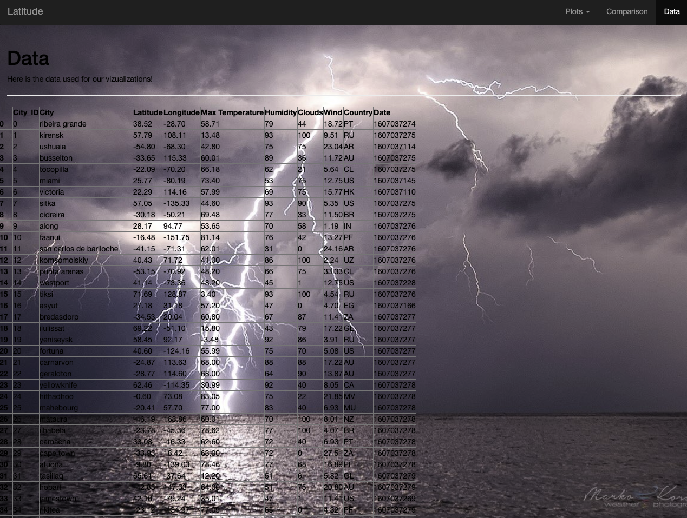

# Web Visualization Dashboard

## Background

Data is more powerful when we share it with others. Here we take our weather Data from our Weather-Api project and 
create a web dashboard using HTML, CSS, and Flask to display our data. Each visualization is a link to that page that shows
an in depth analysis of the data.

### App.py

Here are the routes used to link our webpages together: 

### body-styles.css

A template was made for the style of each webpage for quickly building our pages:

### csv_to_html and cities.html

A Python Script was created to make the transition from csv to a table in html:

### Application Deployment 

